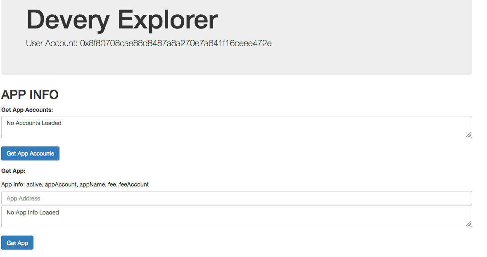

# Devery Explorer

Here's my [demo video](https://youtu.be/dNfKtq-Z2bA).

## Description

This app gives an interface to easily explore some of the Devery information stored. This kind of easy to use interface will be required to allow app users the ability to determine if products, items, etc information claimed by an app is actually real. I also would've found something like this really useful when I first started working on my other Hackathon entry to confirm operation so maybe someone else will find it helpful some day!



## Running Project

Clone project: ```https://github.com/johngrantuk/deveryExplorer```

```cd deveryExplorer```

Then: ```npm install```

Then: ```yarn start```

## Team Members and Contact info

John: @johngrantuk on github, johngrantuk@googlemail.com
